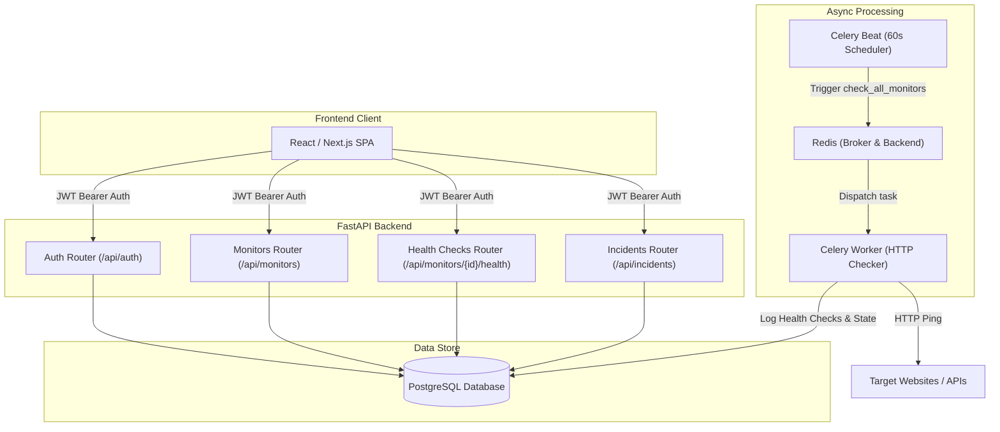
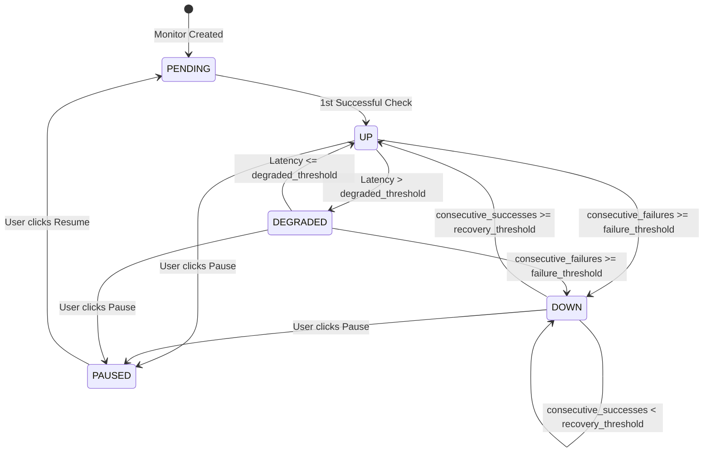

# PulseOps Backend Flow & Frontend Integration Specification

This document provides a complete specification of the **PulseOps** backend architecture, database entities, state machines, and REST API endpoints. Frontend developers or AI agents can use this guide as a blueprint to build the PulseOps frontend application.

---

## 1. System Architecture Overview



---

## 2. Authentication & Token Management

PulseOps uses **JWT (JSON Web Token)** authentication with dual token handling:
- **Access Token**: Short-lived JWT passed in the request header (`Authorization: Bearer <access_token>`).
- **Refresh Token**: Stored in PostgreSQL `refresh_tokens` table. Used to request a new access token when expired.

### Token Lifecycle & Frontend Flow
1. **Register / Login**: Returns `{ access_token, refresh_token, token_type: "bearer" }`. Frontend stores both tokens securely (e.g., in HTTP-only cookies or encrypted localStorage).
2. **Authenticated Requests**: Pass `Authorization: Bearer <access_token>` header on all `/api/monitors` and `/api/incidents` calls.
3. **Token Refresh**: When an API call returns `401 Unauthorized`, post `refresh_token` to `/api/auth/refresh` to acquire a fresh `access_token`.
4. **Logout**: Post `refresh_token` to `/api/auth/logout` to revoke the refresh token in the backend.

---

## 3. Data Models & TypeScript Types

### User
```typescript
interface User {
  id: number;
  name: string;
  email: string;
}
```

### Monitor
```typescript
type MonitorStatus = "PENDING" | "UP" | "DEGRADED" | "DOWN" | "PAUSED";

interface Monitor {
  id: number;
  name: string;
  url: string;
  method: "GET" | "HEAD";
  interval: number; // In seconds (default: 60, min: 10)
  timeout: number; // In seconds (default: 10, min: 1, max: 60)
  expected_status: number; // e.g. 200 (100-599)
  failure_threshold: number; // Failures required before DOWN (default: 2, 1-10)
  consecutive_failures: number;
  consecutive_successes: number;
  degraded_threshold: number; // Response time ms threshold for DEGRADED (default: 2000ms)
  recovery_threshold: number; // Successes required before recovering to UP (default: 2, 1-10)
  status: MonitorStatus;
  is_active: boolean;
}
```

### HealthCheck
```typescript
type HealthCheckStatus = "UP" | "DEGRADED" | "DOWN";

interface HealthCheck {
  id: number;
  monitor_id: number;
  user_id: number;
  status: HealthCheckStatus;
  status_code: number | null;
  response_time: number | null; // In milliseconds
  error: string | null;
  checked_at: string; // ISO DateTime string
}
```

### Incident
```typescript
type IncidentStatus = "OPEN" | "RESOLVED";

interface Incident {
  id: number;
  monitor_id: number;
  status: IncidentStatus;
  reason: string | null;
  started_at: string; // ISO DateTime string
  resolved_at: string | null; // ISO DateTime string or null
  duration: number | null; // In seconds
}
```

---

## 4. API Endpoints Reference

### 🔐 Authentication (`/api/auth`)

| Method | Path | Auth Required | Description |
| :--- | :--- | :--- | :--- |
| `POST` | `/api/auth/register` | No | Register a new account (`name`, `email`, `password`) |
| `POST` | `/api/auth/login` | No | Authenticate user (`email`, `password`) -> Returns tokens |
| `POST` | `/api/auth/refresh` | No | Get new access token (`refresh_token` query param) |
| `POST` | `/api/auth/logout` | No | Revoke refresh token (`refresh_token` query param) |
| `GET` | `/api/auth/me` | **Yes** | Get current authenticated user details |

#### Payload Examples
- **Register Body**: `{ "name": "John Doe", "email": "john@example.com", "password": "securepassword123" }`
- **Login Body**: `{ "email": "john@example.com", "password": "securepassword123" }`
- **Token Response**: `{ "access_token": "eyJ...", "refresh_token": "eyJ...", "token_type": "bearer" }`

---

### 📡 Monitors (`/api/monitors`)

| Method | Path | Auth Required | Description |
| :--- | :--- | :--- | :--- |
| `GET` | `/api/monitors` | **Yes** | List all monitors owned by user |
| `POST` | `/api/monitors` | **Yes** | Create a new monitor |
| `GET` | `/api/monitors/{id}` | **Yes** | Get details for a specific monitor |
| `PATCH` | `/api/monitors/{id}` | **Yes** | Update monitor settings |
| `DELETE` | `/api/monitors/{id}` | **Yes** | Delete a monitor (HTTP 204) |
| `POST` | `/api/monitors/{id}/pause` | **Yes** | Pause monitor (sets `is_active=False`, `status="PAUSED"`) |
| `POST` | `/api/monitors/{id}/resume` | **Yes** | Resume monitor (sets `is_active=True`, `status="PENDING"`) |

#### Create / Update Payload Parameters
```json
{
  "name": "Production API",
  "url": "https://api.example.com/health",
  "method": "GET",
  "interval": 60,
  "timeout": 10,
  "expected_status": 200,
  "failure_threshold": 2,
  "degraded_threshold": 2000,
  "recovery_threshold": 2
}
```

---

### 📊 Health Checks & Statistics (`/api/monitors/{id}`)

| Method | Path | Auth Required | Description |
| :--- | :--- | :--- | :--- |
| `GET` | `/api/monitors/{id}/health` | **Yes** | Get health check logs with pagination |
| `GET` | `/api/monitors/{id}/stats` | **Yes** | Get monitor performance stats & uptime % |

#### Query Parameters for `/health`
- `limit`: int (default: 50, min: 1, max: 100)
- `offset`: int (default: 0)

#### Response for `/health`:
```json
{
  "items": [
    {
      "id": 105,
      "monitor_id": 1,
      "user_id": 1,
      "status": "UP",
      "status_code": 200,
      "response_time": 142,
      "error": null,
      "checked_at": "2026-09-02T16:00:00Z"
    }
  ],
  "total": 1420,
  "limit": 50,
  "offset": 0
}
```

#### Query Parameters for `/stats`
- `days`: int (default: 30, min: 1, max: 30)

#### Response for `/stats`:
```json
{
  "monitor_id": 1,
  "period_days": 30,
  "uptime_percentage": 99.85,
  "total_checks": 43200,
  "successful_checks": 43135,
  "failed_checks": 50,
  "degraded_checks": 15,
  "average_response_time": 184.52,
  "max_response_time": 3210
}
```

---

### 🚨 Incidents (`/api/incidents`)

| Method | Path | Auth Required | Description |
| :--- | :--- | :--- | :--- |
| `GET` | `/api/incidents` | **Yes** | List all incidents for user's monitors |
| `GET` | `/api/incidents/{id}` | **Yes** | Get detailed incident report by ID |

#### Incident Response Object:
```json
{
  "id": 12,
  "monitor_id": 1,
  "status": "RESOLVED",
  "reason": "Expected 200, got 503",
  "started_at": "2026-09-02T14:10:00Z",
  "resolved_at": "2026-09-02T14:15:30Z",
  "duration": 330
}
```

---

## 5. Backend Logic & State Machine



1. **Failure Rule**: When a health check fails (or returns a status code != `expected_status`), `consecutive_failures` increases. When `consecutive_failures >= failure_threshold`, status changes to `DOWN` and an `OPEN` **Incident** is created.
2. **Recovery Rule**: While `DOWN`, successful checks increment `consecutive_successes`. When `consecutive_successes >= recovery_threshold`, status reverts to `UP`, the `OPEN` **Incident** changes to `RESOLVED`, and `duration` is calculated.
3. **Degraded Rule**: A check with expected status code but `response_time > degraded_threshold` sets status to `DEGRADED`.
4. **Data Retention**: Background worker purges health checks older than **31 days** every 24 hours.

---

## 6. Recommended Frontend Screen Architecture

1. **Auth Pages**:
   - `/login` - Login form with error handling.
   - `/register` - Registration form.

2. **Dashboard Overview (`/`)**:
   - Summary cards: Total Monitors, System Health %, Open Incidents, Avg Response Time.
   - Quick action: Add New Monitor modal/button.
   - Monitor List cards showing live badge status (`UP`, `DOWN`, `DEGRADED`, `PAUSED`).

3. **Monitor Detail Page (`/monitors/[id]`)**:
   - Status header & quick controls (Pause / Resume / Edit / Delete).
   - Key Metrics Widgets (30-day Uptime %, Avg Latency, Max Latency, Total Checks).
   - Response Time Trend Chart (Line chart over time).
   - Health Check Log Table with pagination controls.
   - Incidents history list associated with this monitor.

4. **Incidents Page (`/incidents`)**:
   - Filterable list of incidents (`OPEN` vs `RESOLVED`).
   - Incident details showing start time, resolution time, failure cause, and downtime duration.
